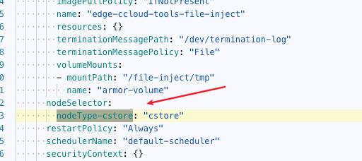
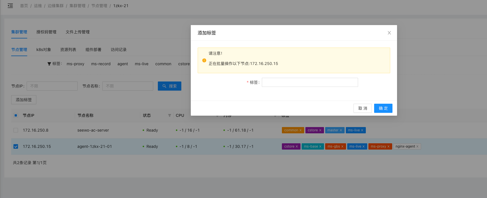
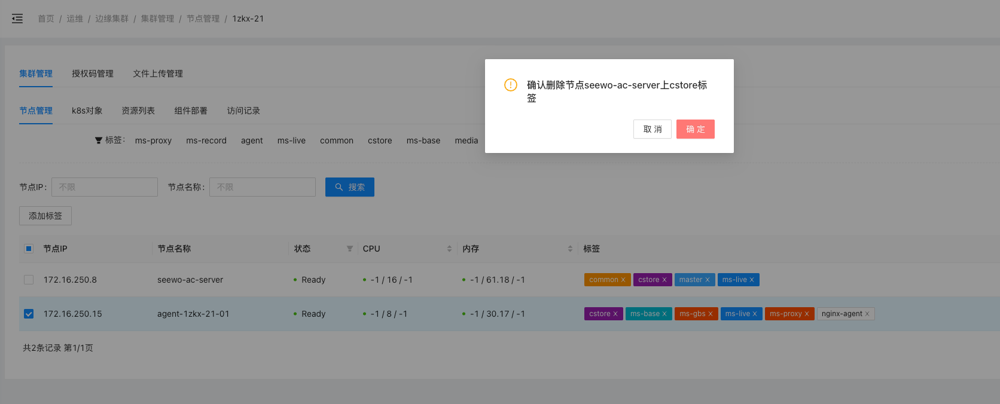

# 背景

原多个服务器上应用，运行基本互不影响，但是服务器内，可能存在资源超卖（cpu核心和内存），IO 互相影响的问题；

现在，高职教所有服务器组成一个大k3s集群，多个业务之间的应用如何编排？如何将资源利用最大化？如何将互相影响降到最低？

# 需求分析

## 风险识别

1. 哪些应用必须部署在master上？如中间件，8980
2. 哪些应用可以无状态混合部署？
3. 哪些应用是有状态的，需要绑定宿主机部署？如 中间件的持久化在宿主机，调度到其他机器肯定不行；
4. 哪些应用只能在特定机器之间混合部署？如直播功能，推拉流对磁盘和网络带宽都有一定要求；
5. 各应用重要等级划分，如何优先保障核心服务？

## 应用特性梳理

有状态应用，特定机器混部署、核心保障服务

[https://doc.weixin.qq.com/sheet/e3_AUkAHwYnAHIrZR21RnbRPSRtTxgae?scode=AKEAkwcCAA45WPxLzcAUkAHwYnAHI&tab=iahzme](https://doc.weixin.qq.com/sheet/e3_AUkAHwYnAHIrZR21RnbRPSRtTxgae?scode=AKEAkwcCAA45WPxLzcAUkAHwYnAHI&tab=iahzme)

# 方案设计

## 标签设计

所有服务器组成一个集群后，服务器类型不会完全抹去，如专门用于存储的服务器，所以，除了区分master和agent的标签外，还需要给某些服务器打上专属应用标签。

| 标签 | 描述 | 用途 |
| --- | --- | --- |
| 节点类别 | nodeType-master=masternodeType-agent=agentnodeType-common=common | 1、应用调度和隔离，将某些核心应用，如UC、课表、中控、班牌、录播 限制在只在系统服务器之间启动。2、开通了“教学质量管理平台”、“门牌本地化”、“中控本地化”等应用组的节点定义为系统服务器，系统服务器具有更高的系统稳定性。系统服务器通常由master节点和1-2个agent节点组成。3、应用没有打标签，或者打的是agent标签，但是在部署第一台master节点时，会给应用打上nodeType-common=common 标签，使得它在还没有agent节点时不至于找不到合适节点启动。 |
| 应用组类别 | 根据部署时选择的应用组打标签appGroup-gzj-lubo-local=gzj-lubo-localappGroup-media_convergence=media_convergence一个节点可以开通多个应用组 | 区分节点开通了哪些应用组 |
| 业务应用类别 | 业务应用在特定节点调度，则需要在部署时，选择应用组，就给当前节点打上业务应用的标签，例如：nodeType-cstore: cstore业务应用标签、应用、应用包、应用组 关系：以应用包为单位，给应用包内的多个应用整体打标签；，如nodeType-cstore: cstore，所以需要保证一个应用包是职责单一的，否则就拆成多个应用包；应用包具有业务应用标签，应用组关联该应用组，则服务器部署时选择了应用组，会将应用组的业务应用标签全部给当前节点打上标签；应用组1 和应用组2 都关联了应用包A，那么应用包A会在部署了应用组1和应用组2的节点上调度。 | 1、应用调度和隔离为了防止其他应用调度到业务特定节点，所以这些业务特点节点的agent节点，不能再打上nodeType-agent=agent。 |

### 服务器部署打标签

什么时候给节点打标签？

给节点打哪些标签？

1、三种标签打标签流程如下：

- master节点必须为系统服务器，开通应用组前打上master相关标签；
- 非master节点在加入集群后，开通应用组之前打标签。

2、最终打完标签示意图：

- master节点可以有的标签：nodeType-master=master、nodeType-common=common、appGroup-xxx=xxx（xxx表示应用组名称）、nodeType-xxx=xxx（xxx表示应用标识）
- 系统服务器的agent节点可有的标签：nodeType-agent=agent、nodeType-common=common、appGroup-xxx=xxx（xxx表示应用组名称）、nodeType-xxx=xxx（xxx表示应用标识）
- 业务服务器可以有的标签：appGroup-xxx=xxx（xxx表示应用组名称）、nodeType-xxx=xxx（xxx表示应用标识）

### 应用标签维护

哪些应用包需要定义应用标签？

如何维护日益增加的应用标签？

应用部署如何设置标签？

1、应用包定义应用标签约定

在现有边缘部署场景，应用组和服务器依然是近乎1对1的关系，一个应用组代表的就是一种服务器类型；一个应用组的应用只在特定节点启动，并且非该应用组的应用不能在该节点启动（共享应用除外）；

在高职教场景，有系统服务器和业务特定服务器的概念区分：

- 系统服务器可以是多个节点组成，并且包括master节点，其中应用为多个业务共同组成一个web平台，稳定且持续高可用对学校师生提供访问能力；系统服务器中多个应用组涵盖多个业务，十几个应用，可共享系统服务器资源。
- 业务特定服务器，一般对磁盘、带宽、CPU有特殊要求，且运行环境要求独立；没有特殊情况，只限同一个应用组内的应用共享节点资源。

系统服务器和业务特定服务器之间除共享应用外，完全隔离，运行环境互不影响。

系统服务器的应用一般都是不打标签，或者打了master、agent标签，无需给应用打特定应用标签，就会限制只在系统服务器启动。

**因此除了属于系统服务器的应用组，其他应用组中的应用有特定节点环境运行要求都需要定义应用标签，**如“语音转写”、“流媒体”、“媒体融合”、“云录播”等。

2、应用标签维护

以应用包为单位设置应用标签，在鲸云包版本维护应用标签，现阶段，节点类型标签和应用标签混用，不便于业务使用，容易选错，且下拉框内容混乱；同时应用标签的增加需要人为维护，增加沟通成本。

在包版本增加一个应用标签输入框，定义好格式和规则（只能由字母、数字或 - 组成，6到24个字符，pattern: ^[a-z][0-9a-z|-]{4,22}[0-9a-z]$），由业务维护者自定义输入；在保存时检测其输入内容是否符合要求。

3、应用部署标签设置

[鲸云-标签管理与应用编排](/pages/viewpage.action?pageId=480820690)

由鲸云负责应用组部署，在应用部署yaml文件中设置nodeSelector

部署好之后，在鲸云上显示：

4、应用组升级对应用标签的影响

应用组新增应用包，且具有应用标签，在应用组升级时，如何先给特定节点打上该应用标签？

应用组升级和给节点打上新应用标签，有先后顺序，节点打上新应用标签必须在应用组预检前，否则应用组预检不通过。

（1）手动给节点打标签

在应用中升级前，找到开通了该应用组的节点打上新应用包的应用标签；目前可以在鲸云上操作，但是不是所有人有权限；可以用来临时打标签，但用于多个学校批量升级，手动打标签的人工成本较高。

（2）定时给节点打标签

在部署时，节点上已经打上特定应用组标签，那么只需要写一个定时任务，定时检查每个节点上的应用组最新版本（测试版本输入了该机构码）的应用标签和本地节点对比，是否有新增，新增则给节点打上新应用标签。

风险评估：

- 对旧应用的影响，旧应用被加到另外一个应用组，在这个应用组还没有升级前，重启应用可能调度到现有非预期节点，但整体看风险可控。
- 对新应用的影响，因为新应用还没有部署，所以无不良影响。

（3）升级前主动向边缘发送打新标签指令

什么时候下发打标签指令？应用组预检前就需要给相应节点打上新标签，否则应用组预检会失败。

通过IOT下行通道，在应用组升级前下发指令，边缘接受指令给节点打标签，整个过程异步，如何保证可靠？

应用组删除应用包，且具有应用标签，在应用组升级时，是否需要删除特定节点上该应用标签？

假设应用组1 和应用组2 都包含应用包A，此时应用组1在新版本中去除了应用包A，应用组1升级后，应该将应用组1所在节点上应用包A的应用标签**删除**，否则应用包A重启，就有可能在应用组1所在节点启动。

应用组升级和删除节点上应用标签没有严格顺序，删除节点上应用标签可以放在应用组升级完成之后执行。

（1）定时检测本地节点的应用标签和部署应用组版本的应用标签是否一致，云端缺少的，则将本地节点上多的标签删除。

应用组部署版本删除应用标签A，但应用组最新版本又有应用标签A，此时就不能删除了。

（2）升级前主动向边缘发送删除标签指令

通过IOT下行通道，在应用组升级前下发指令，边缘接受指令给节点打标签，整个过程异步，如何保证可靠？

## 应用副本动态扩容

应用包目前只有一套模版，部署时副本数和cpu配置是固定的，现在多个应用组部署在一起，对共享应用的资源需求会增加；

在不改变原模版配置的前提下，性能如何做到动态扩展？

在一个大集群里，多种服务器中部署的应用特点以及性能要求如下：

| 服务器类型 | 应用 | 部署特点/性能要求 |
| --- | --- | --- |
| 系统服务器1-3台（其中1master） | UC、课表 | 多个业务共享目前沿用模版环境副本数性能支撑没问题 |
| 存储服务器可能有很多，少则几台，多则十几台 | cstore、音视频等 | 按照旧单机部署，每台存储服务器上都会有cstore，音视频等应用，且完全独立运行；采用集群化部署后应用共享，应用副本数不一定和服务器数量一一对应：cstore应用的特点，无状态，对外提供获取上传策略，下载链接等能力，性能要求不高，但是对于十多台存储服务器，也需要在原模版环境1副本上进行少量扩容，如5台服务器，部署2个cstore副本，10台服务器，部署4个cstore副本；音视频应用的特点，大部分有状态，且性能依赖磁盘IO和网络带宽，如直播能力，推拉流，所以部分应用需要每台存储服务器都部署一个副本，以尽可能利用服务器磁盘IO和网络带宽资源； |
| 语音转写服务器也可能有多台 | 语音服务、内容安全服务 | 旧部署方式同理存储服务器，每台语音转写服务器都会部署相同应用且独立运行；内容安全服务，无状态，同cstore 副本扩容策略；语音服务，根据以往运行特点来看，内存等资源要求很高，所以尽可能利用语音转写服务器的资源，应用副本数 跟随服务器数量增加，有多少台语音转写服务器，就有多少个应用副本。 |

根据以上服务器类型和应用特点，总结有两种部署要求，以及给出对应解决方案：

| 应用部署要求 | 解决措施 | 维护成本 |
| --- | --- | --- |
| 可以根据服务器数量（规模），动态增加应用副本数 | 应用组资源配额管理，配置多种资源配额方案，如：单机：保持和模版环境一致中等：部分应用 2副本高等：部分应用3副本在部署服务器，选择应用组时，选择相应配额方案，如部署第1-4台存储服务器时，选择单机配额部署第5-8台存储服务器时，选择中等配额部署第9台以上存储服务器时，选择高等配额这个配额方案可以设置多个，不一定是高中低三个。 | 1、业务需要维护多个配额方案2、部署要求增加，依赖FAE 部署时选择合适的配额方案 |
| 每台服务器都需要一个应用副本 | 应用以 daemonset 类型部署 | 1、鲸云需要开发支持 daemonset 类型应用2、业务新建应用，选择daemonset，并废弃原deployment应用 |

## 核心服务保障

应用重要等级参考[鲸云线上定义](http://应用分级说明)，SS、S、A、B

| 级别 | 定义 | 部署要求 |
| --- | --- | --- |
| SS | 极其重要的基础应用被多个业务强依赖对延时极度敏感一旦出故障，会影响到多个核心业务完全无法正常使用 | 核心数据异机备份快速恢复预案 |
| S | 非常重要的应用某一个业务的核心应用对延时敏感一旦出故障，会导致单个核心业务无法主流程无法提供服务 | 容器多副本故障转移 |
| A | 一般的应用对延迟容忍一般出现故障，某一个业务的某一个功能会受损，但是不影响到主流程 | 单副本 |
| B | 边缘性应用用户量较少或者用户对故障的容忍性很高对延迟非常不敏感或者无感知出现故障，用户在很长时间内可能都无法发现 | 单副本 |

对应用划分等级后，有哪些保障手段？

- OOM保护，容器内存快要达到95%*limit 时触发limit扩容*1.5
- 驱逐保护，资源紧张，发生驱逐时，低优先级的应用会先被驱赶；
- 进程资源优先使用权，高优先级的应用具有进程级别资源（CPU、IO）优先使用权；

