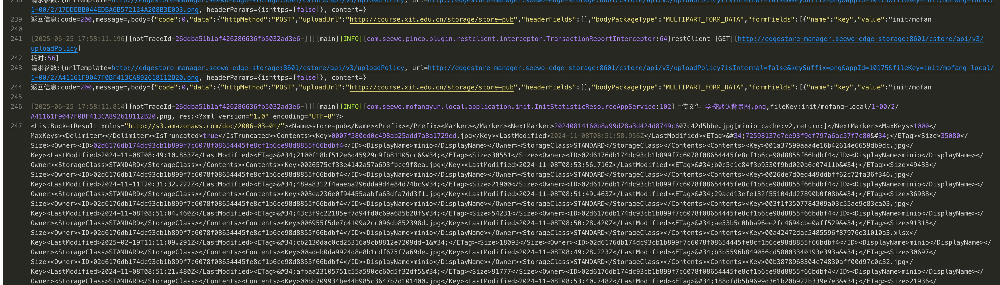
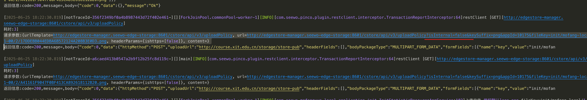

| 问题 | 描述 | 优化措施 |
| --- | --- | --- |
| agent加入集群文件拷贝失败 | agent节点会通过rsync 命令拷贝一些文件到master由于master节点没有安装rsync，导致拷贝失败使用rsync，要求两端都要安装rsync | 在master更新时安装rsync |
| agent多台机器minio需要手动部署 | 由于历史原因，磁盘不规则，几个minio是手动部署的，无法用脚本自动化 |  |
| 魔方应用升级过程中起不来 |  魔方启动时会上传文件到本地minio，用了域名，而域名解析有问题，无法正常上传到minio访问域名上传，域名解析为公网，再转发到服务器，请求方法post被转发篡改成了get临时增加域名host |  魔方容器内上传改为内网ip |
| DB迁移不够顺利 | 部分节点迁移失败或者遗漏，需要手动迁移 |  |

